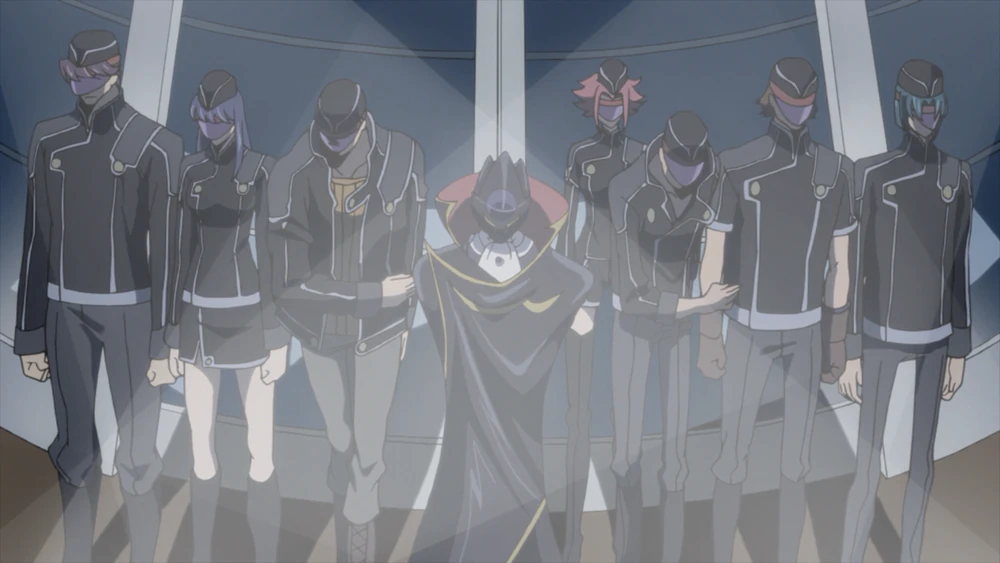

The Cover photo was taken in Kamakura, when I was just walking around that city with my friend.

## Outcomes & Failures

Story of being interviewed a lot started from 24, Nov and it has been 2 months.

### Outcomes

It's good to announce that most of the interview were very successful. Till now I have 2 offers. One is a small Taiwanese tech company which focues mainly on the SEO, Advertising something like that. Since they're resposing too slow, I am going to reject the offer.

And another is a Chinese SES company which is on its turning to some new services. Because of that, the company has mainy two parts of services that's running, one is traditionally SES, it just looks like Japan, tastes like Japan and smells like Japan. Well. And the another part is doing some cloud services, including AWS, ServiceNow. I was told that I will be working for the ServiceNow part, which is conducted in the company, a decent tower-like building in Minato, Tokyo.

The company promises that they can provide a platform for me to start with ServiceNow and it requires quite high proficiency of Japanese. However, story is that I could be working as a SES member at beginning since at the time I'm joining the company there maybe no vacancy for a beginner. In that case I will take a bridge as a SES member for several months I guess. Longer or shorter, who knows?

### Failures

Actually I failed interviews for two companies which are not so small, maybe 300 employees involved. There's only one complaint that I need to say that one of them, which conducted an interview from 8 P.M. and lasted an hour. Well, are they paid to interview me so late a time?

There was my only offline interview conducted in their company build, which they own it, with an arch with the name written on it, it did look like something I have to admit. But I failed, don't know why though. The interview was devided into two parts, one is the most common but face-to-face, then a little test, mathematics.

## Little Thought

### Market Breakers

There's a undeniable fact that many Chinese SES company in Japan they're actually breaking the laws in Japan. For example, the mostly talked, you should be payed fully if you have no active current projects, or gennba. But as far as I know, 99% existing Chinese SES companys do not obey the laws.

Maybe some people may complain that it's Chinese company that do break the laws. But I don't think so. Because in such a market, there're companies they're cutting their costs by doing so, it will push other companies to do as they do. It's a negative circulation. As a matter of fact one Taiwanese company that I contacted is doing so, either, which is paying 100,000 JPY to those employees who don't have project to get involved in. 100,000J JPY, it can only afford the rent for a small 1K apartment and all the fees such as electricity, water and gas, that'cool, huh? If the government still keep its stillness, things will getting worse and worse or they're justing sitting there as nothing is taking place?

It makes me wonder the reason why. The stucture of the industry is just out of the line. Japan is not a country which shared the development of the big boom of information and Internet. It was assisting on its more than strong manufacturing basis and all the later-coming IT industries are working to serve the manufacturing business. That's why most of the IT companies in Japan are to B2B not B2C. Because it has to attach to the big giant manufacturers to survive and almost all the clients are attached to this mega manufacturers.

### Japan the Black Knights

**Lay off.** There's crazy lay off that's taking place. Because of that many people got their jobs lost and come to Japan. It's surprising that Japan is so absorbing to taking them. Although I am not one of these unluckies that get laid off, I come to Japan as loser, for I don't think I can find any job in China. That's only about the market, I am not mentioning that there're many other issues such as human rights though.

When I am a literally totally loser and it's only Japan that I can go. Japan is a like a cradle for those people who are down. It's true that you got not that well paid comparing to other major developed countries, but Japan will make sure at least everything it not too bad.

It reminds it of The Black Nights.

as that goes:

>***People! Fear us, or rally behind us as you see fit. We are the Black Knights. We of the Black Knights stand with all those who have no weapons to wield, regardless of whether they be Elevens or Britannians.***
>
>***人々よ！我らを恐れ、求めるがいい、我らの名は黒の騎士団！我々黒の騎士団は武器を持たない全ての者の味方である。イレブンであろうとブリタニア人であろうと。***