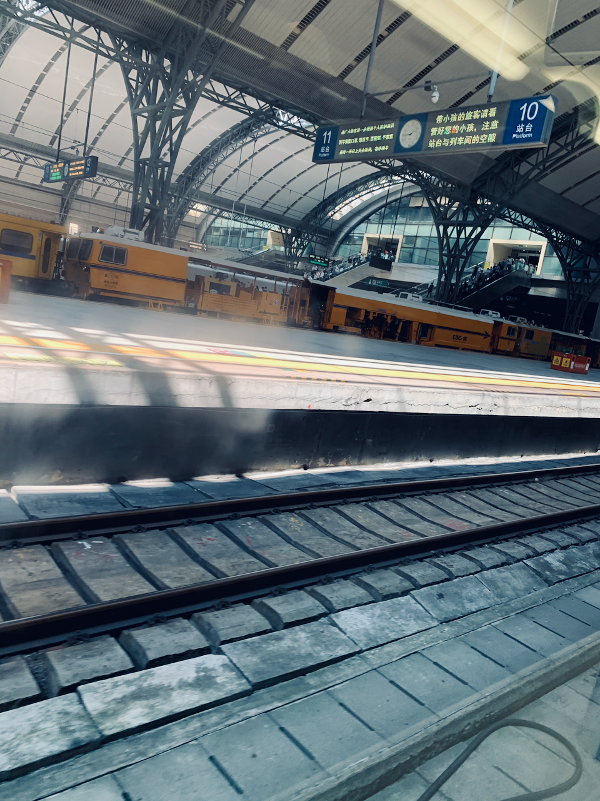

## Farewell

 

I had my cover picture taken at the top of the building which is full of offices and labs on April 15, 2021 since 1 month after breaking up with my girlfriend. 5 months later, I stood on the same place of the same building and took a picture from the same angle with a second-hand camera with roll films with a totally different heart than myself 5 months before.

Yes, acutally that was my last day at my college, I took a long ride to arrive there and I had only 3 days prepared for the exiting procedure.

I remember my last night at my dorm, we played a board game and that was very interesting. And it's clear for me that I was the final winner. "The monster `CAPTIALIST` you are!", I could catch their point, though, I believe anyone who was brought up in China can, that was a amazing game.

I went to another campus in order to have my exiting documents stamped. And it took me 2 days to complete. After I was on the train going back to my home, I know that my university is gone.

## From the start

I arrived on the station at around 10 P.M.. It was my longest trip and it took me 7 hours from my hometown to the city where my university was in. 